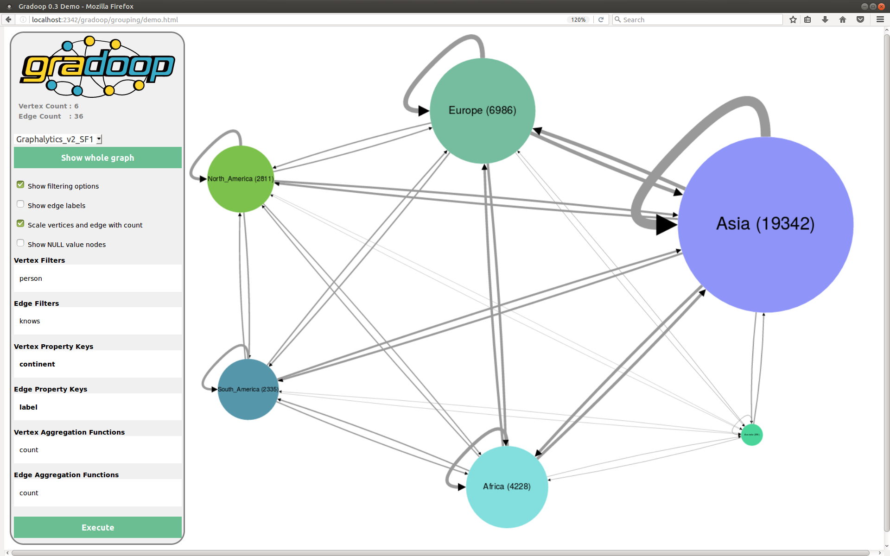

## Demo application for Graph Grouping

### Description

Property graphs are an intuitive way to model, analyze and visualize complex relationships
among heterogeneous data objects, for example, as they occur in social, biological and information
networks. These graphs typically contain thousands or millions of vertices and edges and their entire
representation can easily overwhelm an analyst. One way to reduce complexity is the grouping of
vertices and edges to summary graphs. We presented an algorithm for graph grouping
with support for attribute aggregation and structural summarization by user-defined vertex and edge
properties. The algorithm is part of [GRADOOP](http://www.gradoop.com), an open-source system for graph analytics.
GRADOOP is implemented on top of [Apache Flink](http://flink.apache.org), a state-of-the-art distributed dataflow framework, and thus
allows us to scale graph analytical programs across multiple machines.

We implemented a demo application for visualizing summary graphs. A user can adjust the parameters for
graph grouping and execute the operator locally using Apache Flink.

### Demo Instructions

* Clone the repo
* Run `org.gradoop.demos.grouping.server.Server`
* Navigate to `http://localhost:2342/gradoop/grouping/demo.html`
* Select data set from drop down list (initial meta data computation takes a few seconds)
* Enjoy

#### Add new graphs

* Create a CSV graph using Gradoop (see [gradoop-examples](https://github.com/dbs-leipzig/gradoop/tree/master/gradoop-examples/src/main/java/org/gradoop/examples/io))
* Copy CSV graph to `src/main/resources/data`
* Restart the server

### Award

* [Best Demo Award BTW 2017](http://btw2017.informatik.uni-stuttgart.de/?pageId=Awards&language=de)

### Further reading

* [Distributed Grouping of Property Graphs with GRADOOP, BTW Conf., March 2017](http://dbs.uni-leipzig.de/file/BTW17_Grouping_Research.pdf)
* [Extended Property Graphs with Apache Flink, SIGMOD NDA Workshop, June 2016](http://dbs.uni-leipzig.de/file/EPGM.pdf)
* [Gradoop Source Code](http://www.gradoop.com)
* [Gradoop Project Page, University of Leipzig](http://dbs.uni-leipzig.de/research/projects/gradoop)

