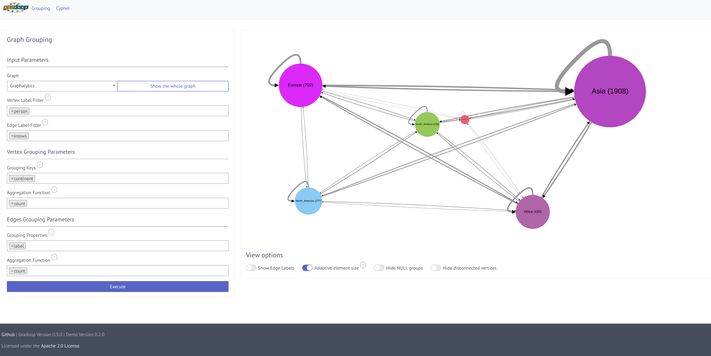

## Demo application for GRADOOP

### Description

Property graphs are an intuitive way to model, analyze and visualize complex relationships among heterogeneous data objects, for example, as they occur in social, biological and information networks. These graphs typically contain thousands or millions of vertices and edges and their entire representation can easily overwhelm an analyst.

[GRADOOP](http://www.gradoop.com) is an open-source system for graph analytics that enables handling of such graphs. GRADOOP is implemented on top of [Apache Flink](http://flink.apache.org), a state-of-the-art distributed dataflow framework, and thus allows us to scale graph analytical programs across multiple machines.

In this application we demonstrate two GRADOOP operators: [Graph Grouping](http://dbs.uni-leipzig.de/file/BTW17_Grouping_Research.pdf) and [Cypher-based Graph Pattern Matching](https://dbs.uni-leipzig.de/file/GRADES17_Cypher_in_Gradoop.pdf). A user can choose between different input graphs and adjust the operator parameters. The computation is executed on the user machine by automatically starting an Apache Flink cluster.

#### Graph Grouping 

One way to reduce complexity of a large property graph is the grouping of vertices and edges to summary graphs. We developed an algorithm for graph grouping with support for attribute aggregation and structural summarization by user-defined vertex and edge properties. The operation is very similar to a GROUP BY operation known from relational databases but in addition summarizes the graph structure according to the computed vertex and edge groups.

#### Cypher-based graph pattern matching

Graph pattern matching is an important and challenging operation on graph data. Typical use cases are related to graph analytics. Since analysts are often non-programmers, a graph system will only gain acceptance, if there is a comprehensible way to declare pattern matching queries. However, respective query languages are currently only supported by graph databases but not by distributed graph processing systems. To enable pattern matching on a large scale, we implemented core features of the declarative graph query language [Cypher](https://neo4j.com/developer/cypher-query-language/) within GRADOOP.

### Demo Instructions

* Clone the repo
* `$ mvn clean install`
* `$ mvn exec:java -Dexec.mainClass="org.gradoop.demo.server.Server"`
* Navigate to `http://localhost:2342/gradoop/html/grouping.html` or `http://localhost:2342/gradoop/html/cypher.html`
* Select data set from drop down list
* Enjoy

#### Add new graphs

* Create a CSV graph using Gradoop (see [gradoop-examples](https://github.com/dbs-leipzig/gradoop/tree/master/gradoop-examples/src/main/java/org/gradoop/examples/io))
* Copy CSV graph to `src/main/resources/data`
* Add it to the input graph drop-down of the html files
* Restart the server

### Awards

* [Best Demo Award BTW 2017](http://btw2017.informatik.uni-stuttgart.de/?pageId=Awards&language=de)

### Further reading

* [Cypher-based Graph Pattern Matching in Gradoop, GRADES 2017, May 2017](https://dbs.uni-leipzig.de/file/GRADES17_Cypher_in_Gradoop.pdf)
* [Distributed Grouping of Property Graphs with GRADOOP, BTW Conf., March 2017](http://dbs.uni-leipzig.de/file/BTW17_Grouping_Research.pdf)
* [Extended Property Graphs with Apache Flink, SIGMOD NDA Workshop, June 2016](http://dbs.uni-leipzig.de/file/EPGM.pdf)
* [Gradoop Source Code](http://www.gradoop.com)
* [Gradoop Project Page, University of Leipzig](http://dbs.uni-leipzig.de/research/projects/gradoop)